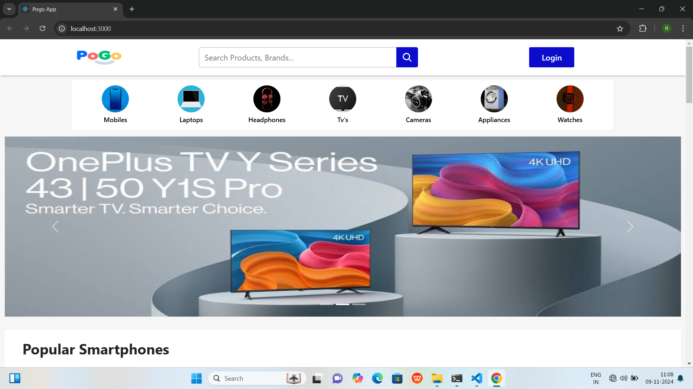
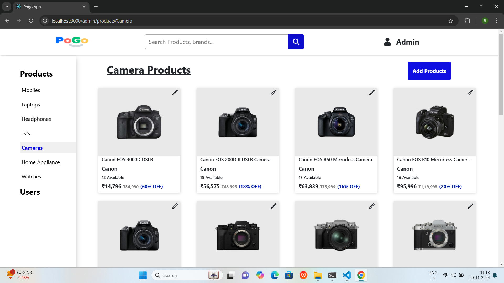
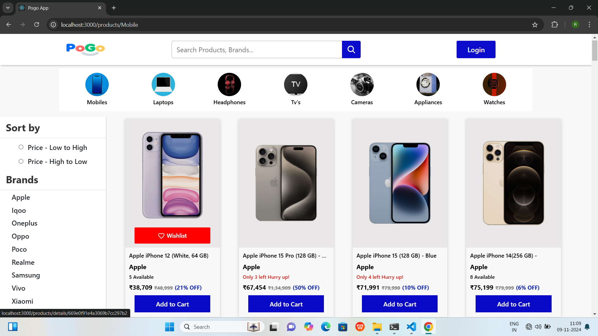
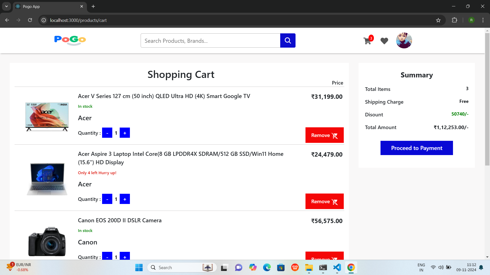
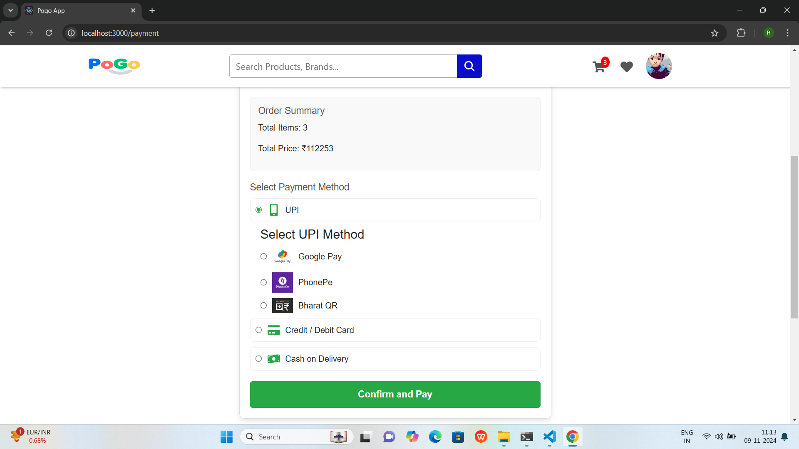

# E-Commerce Application

An e-commerce application built with the MERN stack, featuring separate user and admin modules. Users can explore products, manage their cart and wishlist, and complete demo payments. Admins have complete control over product and user management, including CRUD operations and banning users.

## Table of Contents

- [Features](#features)
- [Demo](#demo)
- [Installation](#installation)
- [Usage](#usage)
- [Technologies Used](#technologies-used)
- [Contributing](#contributing)
- [License](#license)

---

## Features

### User Module

- **Product Browsing**: View, search, and filter products by categories.
- **Cart and Wishlist Management**: Add items to the cart or wishlist, view cart items, and proceed to checkout.
- **Demo Payment**: Checkout process includes a simulated payment gateway.
- **Order Tracking**: View order details and status.
- **Profile Management**: Update personal information and view order history.

### Admin Module

- **CRUD Operations**: Create, read, update, and delete products.
- **User Management**: View, ban, or delete users.
- **Order Management**: Track and update the status of orders.
- **User Ban**: Banned users cannot log in or access the application.

> **Note**: Banned users will be restricted from logging into the application.

---

## Demo

Here are some sample screenshots of the application:

- 
- 
- 
- 
- 

---

## Installation

To run this project locally, follow these steps:

### Prerequisites

- Node.js
- MongoDB (local instance)

### Clone the Repository

Clone the project repository and navigate to the project directory:

```bash
git clone https://github.com/your-username/ecommerce-app.git
cd ecommerce-app
```

# Install server dependencies

cd backend
npm install

Create a .env file in the backend folder with the following values:

PORT=5000
JWT_SECRET=rjrobz17ecommerceapp

# Install client dependencies

cd ../frontend
npm install

# Database Setup

Since the application uses a local MongoDB database, follow these steps to set it up:
Install MongoDB: Ensure that MongoDB is installed on your system and running on the default port (27017).
Import the Database:

```bash
mongorestore --db EcommerceApp /backend/database/EcommercePGApp
```

The backend runs on http://localhost:5000, and the frontend runs on http://localhost:3000.

#### Usage

1. Sign Up or Login: Register as a new user or log in.
2. Browse Products: Use search and filters to find products.
3. Manage Cart and Wishlist: Add items to your cart or wishlist and proceed to checkout.
4. Checkout and Payment: Go through a demo payment gateway to complete orders.
5. Admin Access: Access the admin panel to manage products, users, and orders.

## Admin Credentials

Username: admin@gmail.com
Password: 12345678

### Technologies Used

1. Frontend: React, Redux, Bootstrap
2. Backend: Node.js, Express
3. Database: MongoDB
4. Authentication: JWT
5. Styling: CSS, Bootstrap

### Contributing

Contributions are welcome! If you'd like to contribute, please fork the repository and create a pull request with a description of your proposed changes.

1. Fork the project.
2. Create your feature branch: git checkout -b feature/YourFeature.
3. Commit your changes: git commit -m 'Add some feature'.
4. Push to the branch: git push origin feature/YourFeature.
5. Open a pull request.

### License

This project is licensed under the MIT License.
